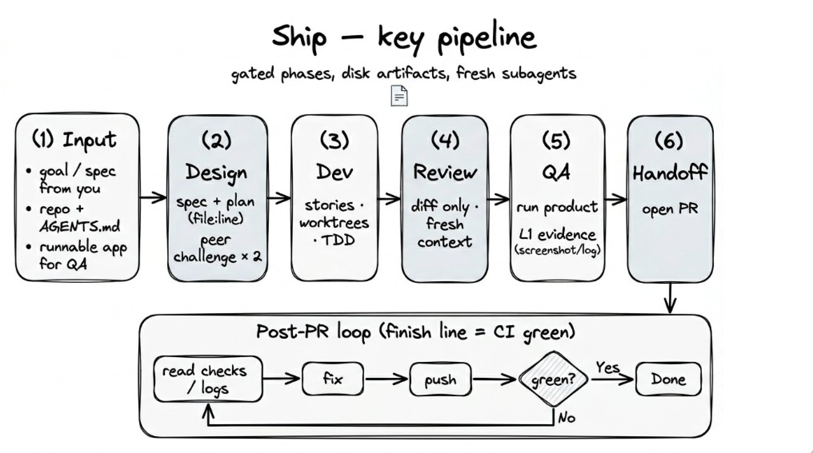

# Ship: AI-Powered Software Development Harness

> An agentic development harness for Claude Code, Codex & Cursor: gated pipeline from spec to green checks.

Ship orchestrates end-to-end software development — planning, implementation, review, QA, and PR creation — with quality gates at every transition.



## How It Works

Ship is a harness, not a copilot. It doesn't help AI write code — it constrains AI to produce reliable results through mechanically enforced quality gates.

**The problem Ship solves:** AI coding agents are capable but unreliable. They skip tests, hallucinate about code they haven't read, review their own work and call it good, and declare victory without evidence. Ship makes these failure modes structurally impossible.

- **Every phase is an isolated subagent.** The reviewer has never seen the implementation context. The QA evaluator can only see the spec, the diff, and the running application. Fresh context per phase means no accumulated bias.
- **Plans are adversarially tested.** An independent peer challenger produces code-grounded objections with file paths and snippets. The planner must respond with evidence, not hand-waving. Two rounds before you see anything.
- **Evidence is hierarchical.** L1 (screenshot, curl response, console log) is the only acceptable proof. L2 (HTTP 200, "tests passed") is insufficient. L3 ("should work based on the code") is an automatic FAIL.
- **State lives on disk, not in memory.** The current phase is tracked in a local state file. On resume, the orchestrator reads it and picks up where it left off. A stop-gate hook blocks session exit while the pipeline is active.
- **The finish line is checks green, not PR created.** After opening the PR, Ship enters a fix loop — read CI failures, dispatch fixes, address review comments, resolve merge conflicts — up to 3 rounds before escalating.
- **Test-driven implementation.** Stories follow a RED-GREEN-REFACTOR cycle with per-story code review before merge.

## Installation

### Claude Code

```
/plugin marketplace add heliohq/ship
/plugin install ship@heliohq
```

### Codex

```
Fetch and follow instructions from https://raw.githubusercontent.com/heliohq/ship/refs/heads/main/.codex/INSTALL.md
```

Codex uses hooks instead of plugins. See [`.codex/INSTALL.md`](./.codex/INSTALL.md) for setup.

### Cursor

```
/add-plugin ship
```

Or search for `Ship` in the Cursor plugin marketplace.

### Verify Installation

Open a fresh session and give it a task — for example, "plan out a user authentication system". Ship should kick in automatically.

### Updating

```
/plugin update ship
```

## Skills

Run `/ship:auto` and Ship handles the full pipeline. Or run individual phases when you only need one:

| Skill | Description |
|-------|-------------|
| `/ship:auto` | Full pipeline: design → dev → review → QA → refactor → handoff |
| `/ship:setup` | Bootstrap repo infrastructure, generate AGENTS.md and safety rules |
| `/ship:design` | Adversarial spec + plan with peer challenge rounds |
| `/ship:dev` | Parallel story implementation via worktrees with per-story review |
| `/ship:review` | Bug-focused diff review — no style nits |
| `/ship:qa` | Test against the running application with L1 evidence |
| `/ship:handoff` | PR creation + CI fix loop until checks green |
| `/ship:refactor` | Four-lens scan, classify by risk, apply with verification |
| `/ship:learn` | Capture session mistakes into persistent learnings |
| `/ship:arch-design` | System design thinking — requirements, components, trade-offs, scaling |
| `/ship:write-docs` | Project documentation with frontmatter, lifecycle, and indexing |
| `/ship:visual-design` | DESIGN.md visual system for consistent UI generation |

Skills trigger automatically based on what you're doing. See [docs/skills.md](docs/skills.md) for detailed guides.

## License

[MIT](LICENSE)

## Acknowledgments

Ship is built on ideas from:

- [agent-browser](https://github.com/vercel-labs/agent-browser) — Browser automation CLI for AI agents
- [Superpowers](https://github.com/obra/superpowers) — Jesse Vincent's agentic skills framework for Claude Code
- [gstack](https://github.com/garrytan/gstack) — Garry Tan's opinionated Claude Code setup
- [awesome-design-md](https://github.com/VoltAgent/awesome-design-md) — The 9-section DESIGN.md format used by `/ship:visual-design`
- [Codex](https://codex.openai.com) — The `.learnings` concept that inspired `/ship:learn`'s staged learning lifecycle
- [Claude Code `/simplify`](https://docs.anthropic.com/en/docs/claude-code) — The built-in skill that inspired `/ship:refactor`'s four-lens scan
