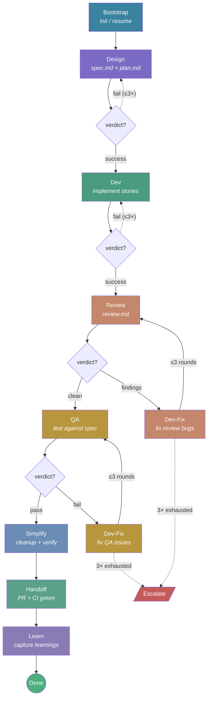

# /ship:auto Pipeline Flowchart

```
SKILL.md (thin relay) → auto-orchestrate.sh (decisions) → Agent() (intelligence)
```


```mermaid
flowchart TD
    BOOT[Bootstrap<br><i>init / resume</i>] --> DESIGN[Design<br><i>spec.md + plan.md</i>]

    DESIGN --> D_V{verdict?}
    D_V -- success --> DEV[Dev<br><i>implement stories</i>]
    D_V -. "fail (≤3×)" .-> DESIGN

    DEV --> DEV_V{verdict?}
    DEV_V -- success --> REVIEW[Review<br><i>review.md</i>]
    DEV_V -. "fail (≤3×)" .-> DEV

    REVIEW --> R_V{verdict?}
    R_V -- clean --> QA[QA<br><i>test against spec</i>]
    R_V -- findings --> RFIX[Dev-Fix<br><i>fix review bugs</i>]
    RFIX -- "≤3 rounds" --> REVIEW

    QA --> Q_V{verdict?}
    Q_V -- pass --> SIMPLIFY[Simplify<br><i>cleanup + verify</i>]
    Q_V -- fail --> QFIX[Dev-Fix<br><i>fix QA issues</i>]
    QFIX -- "≤3 rounds" --> QA

    SIMPLIFY --> HANDOFF[Handoff<br><i>PR + CI green</i>]
    HANDOFF --> LEARN[Learn<br><i>capture learnings</i>]
    LEARN --> DONE((Done))

    RFIX -. "3× exhausted" .-> ESC[/Escalate/]
    QFIX -. "3× exhausted" .-> ESC

    style BOOT fill:#3B82A0,color:#fff
    style DESIGN fill:#7C6BC4,color:#fff
    style DEV fill:#4A9B7F,color:#fff
    style REVIEW fill:#C4876B,color:#fff
    style QA fill:#B8963E,color:#fff
    style SIMPLIFY fill:#6B8CB4,color:#fff
    style HANDOFF fill:#5BA08A,color:#fff
    style LEARN fill:#8B7BB4,color:#fff
    style DONE fill:#4CAF7D,color:#fff
    style ESC fill:#C45B5B,color:#fff
    style RFIX fill:#C4876B,color:#fff
    style QFIX fill:#B8963E,color:#fff
```
