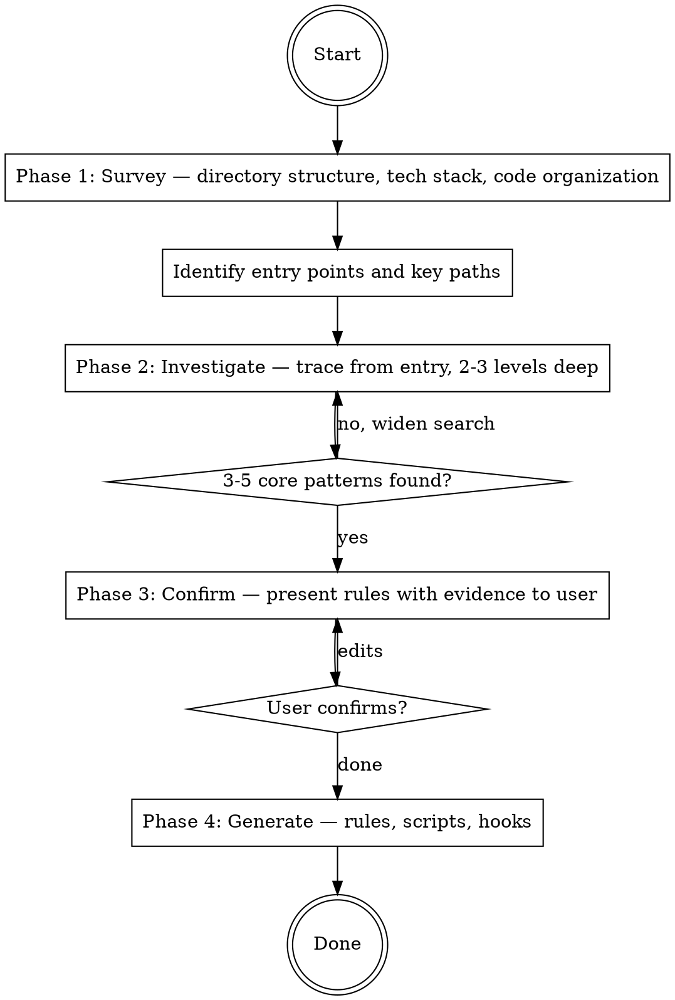

# Ship: Setup Harness

Read the project. Discover its conventions. Generate enforceable rules.

## Principal Contradiction

**The project's implicit conventions vs. mechanically enforceable rules.**

Every project has conventions — in error handling, in validation patterns,
in module boundaries. Most exist only in the team's collective memory or
scattered across code review comments. Setup-harness makes them explicit,
machine-readable, and enforceable.

## Core Principle

```
NO INVESTIGATION, NO RIGHT TO SPEAK.
READ THE CODE BEFORE WRITING ANY RULES.
```

Rules that don't come from the actual codebase are dogma. Every rule
must trace back to a pattern you observed in the code, with file:line
evidence. If you can't point to where the pattern exists, the rule
doesn't belong.

## Process Flow



## Hard Rules

1. Read the code before writing any rules. No exceptions.
2. Every rule must have file:line evidence from the codebase.
3. Aim for 3-5 core rules. More is noise, not value.
4. No templates. No preset rules. Every rule comes from observation.
5. One user interaction: rule confirmation. Do not ask repeatedly.

## Quality Gates

| Gate | Condition | Fail action |
|------|-----------|-------------|
| Survey → Investigate | Entry point identified, tech stack understood | Widen survey |
| Investigate → Confirm | At least 2 patterns found with evidence | Widen investigation |
| Confirm → Generate | User said "done" | Wait |
| Generate → Done | `rules.json` valid, hooks registered | Re-generate |

---

## Phase 1: Survey (概况调查)

**Goal:** Build a mental map of the project in minimal reads.
**Time budget:** Under 2 minutes. Do NOT read file contents yet.

### Step A: Directory structure

```bash
find . -type f -not -path './.git/*' -not -path '*/node_modules/*' -not -path '*/__pycache__/*' -not -path '*/venv/*' -not -path '*/.venv/*' | head -200
```

From this, answer:
- What language(s)? (file extensions)
- How is code organized? (flat, layered, modular, monorepo?)
- Where is source code vs config vs tests vs docs?

### Step B: Project manifest

Read ONE of these (whichever exists):
- `package.json` (Node/TS) — scripts, dependencies, type field
- `go.mod` (Go) — module name, dependencies
- `pyproject.toml` or `setup.py` (Python) — dependencies, tool config
- `Cargo.toml` (Rust) — dependencies, features
- `pom.xml` or `build.gradle` (Java/Kotlin) — dependencies, plugins

From this, answer:
- What frameworks? (Express, FastAPI, Gin, React, etc.)
- What linter/formatter is configured?
- What test framework?

### Step C: Identify entry points

Based on A and B, identify:
- **Main entry:** `src/index.ts`, `cmd/server/main.go`, `app/main.py`, etc.
- **Key paths to trace:** Where does a request/command enter and how does it flow?

Record your findings as a brief mental map. Do NOT present to user yet.

### Step D: Check existing conventions

Quick check — do any of these exist?
- `.eslintrc*`, `ruff.toml`, `.golangci.yml` — linter config (implicit rules)
- `CONTRIBUTING.md`, `STYLE_GUIDE.md`, `ARCHITECTURE.md` — explicit rules
- `CLAUDE.md`, `AGENTS.md` — AI-facing rules
- `.ship/rules/` — existing harness (re-run = update)

If linter config exists, note what it enforces — these don't need
harness rules (the linter already handles them).

---

## Phase 2: Investigate (典型调查)

**Goal:** Trace from entry points 2-3 levels deep. Find 3-5 core patterns.
**Time budget:** Under 5 minutes. Read with purpose.

### What to look for

Start at the entry point identified in Phase 1. Read the file. Then
follow the calls inward, looking for these categories of patterns:

**1. Error handling** — How does this project handle errors?
   - Custom error class? Error codes? Error wrapping?
   - Try/catch patterns? Result types? Error middleware?
   - Read 3-4 files that handle errors. Is there a consistent pattern?

**2. Validation & guards** — How does this project validate input?
   - Schema validation (zod, pydantic, JSON schema)?
   - Manual guard clauses? Middleware?
   - Where in the call chain does validation happen?

**3. Module boundaries** — Are there import restrictions?
   - Do layers exist (handler → service → repo → db)?
   - Are there directories that never import from each other?
   - Is there a clear dependency direction?

**4. Naming & structure** — Are there project-specific conventions?
   - File naming (kebab-case, PascalCase, snake_case)?
   - Function/method patterns (handleX, processX, createX)?
   - Test file conventions (*.test.ts, *_test.go, test_*.py)?

**5. Security patterns** — How are secrets/auth handled?
   - Env var access patterns? Config loading?
   - Auth middleware? Token handling?
   - Files that should never be written to?

### How to read

- Read each file fully, not just the first 50 lines.
- Follow imports 2-3 levels: entry → handler → service → repo.
- When you see a pattern repeat in 3+ files, that's a convention.
- When you see a pattern broken in 1 file out of 10, note the exception.
- **Stop when you have 3-5 patterns with evidence.** Don't keep reading.

### Record findings

For each pattern found, record:
```
Pattern: <name>
Type: structural | semantic
Evidence: <file1:line>, <file2:line>, <file3:line>
Consistency: <N/M files follow this pattern>
Description: <one sentence>
```

---

## Phase 3: Confirm (用户确认)

**Goal:** One interaction. Present findings, get confirmation.

Present discovered patterns to the user:

```text
I read your codebase and found these conventions:

Structural rules (deterministic, deny on violation):
  ✓ [1] <pattern name>
        Evidence: <file1:line>, <file2:line> (<N/M files>)

  ✓ [2] <pattern name>
        Evidence: <file1:line>, <file2:line> (<N/M files>)

Semantic rules (AI-judged, feedback on violation):
  ✓ [3] <pattern name>
        Evidence: <file1:line>, <file2:line> (<N/M files>)

Toggle numbers to enable/disable.
Describe additional rules you want enforced.
Type "done" to generate.
```

Key principles:
- Show evidence for every rule (file:line + consistency ratio)
- Structural vs semantic classification must be explicit
- User can add rules the AI didn't discover (free text)
- One round. Don't re-ask.

---

## Phase 4: Generate (生成)

**Goal:** Create enforceable rules and register hooks.

### Step A: Generate rule files

For each confirmed rule:

**If structural (deterministic):**
- Write a check script to `.ship/rules/structural/<rule-id>.sh`
- Script receives hook input JSON on stdin
- Exits non-zero with error message on violation
- Must be deterministic — same input always produces same output

**If semantic (AI-judged):**
- Write a convention doc to `.ship/rules/semantic/<rule-id>.md`
- Include: rule description, correct example (from actual code), incorrect example, scope, rationale
- Examples must come from the codebase, not invented

### Step B: Generate rules.json

```json
{
  "version": 1,
  "workflow": {
    "phases": {
      "plan": "required",
      "review": "required",
      "verify": "required",
      "qa": "optional",
      "simplify": "optional"
    }
  },
  "structural": [
    {
      "id": "<rule-id>",
      "name": "<rule name>",
      "description": "<one line>",
      "script": "structural/<rule-id>.sh",
      "scope": "<glob pattern>",
      "enabled": true
    }
  ],
  "semantic": [
    {
      "id": "<rule-id>",
      "name": "<rule name>",
      "description": "<one line>",
      "file": "semantic/<rule-id>.md",
      "scope": "<glob pattern>",
      "enabled": true
    }
  ]
}
```

### Step C: Generate enforce-structural.sh

Router script that reads `rules.json`, matches file scopes, runs
applicable structural check scripts. This script is project-specific —
write it based on the project's language and patterns. No template.

### Step D: Register hooks

Read `.claude/settings.json` (create `{}` if missing).
Merge these PreToolUse hook entries, preserving existing hooks:

```json
{
  "hooks": {
    "PreToolUse": [
      {
        "matcher": "Write|Edit",
        "hooks": [{
          "type": "command",
          "command": "bash .ship/rules/enforce-structural.sh",
          "statusMessage": "Checking structural rules..."
        }]
      },
      {
        "matcher": "Write|Edit",
        "hooks": [{
          "type": "agent",
          "prompt": "You are a code convention enforcer. Read .ship/rules/rules.json to find all enabled semantic rules. For each applicable rule (check scope against the file being written), read the rule's .md file from .ship/rules/semantic/. Then verify the code in $ARGUMENTS follows those conventions. If violations found, return JSON with hookSpecificOutput.additionalContext describing each violation and how to fix it. If no violations, return nothing.",
          "model": "claude-haiku-4-5-20251001",
          "statusMessage": "Reviewing coding conventions..."
        }]
      }
    ]
  }
}
```

### Step E: Update .gitignore

Ensure `.ship/tasks/` and `.ship/audit/` are gitignored.
Do NOT gitignore `.ship/rules/` — it must be team-shared.

### Step F: Commit

```bash
git add .ship/rules/ .claude/settings.json .gitignore
git commit -m "feat(harness): generate coding convention rules

<N> structural + <M> semantic rules discovered from codebase analysis.
Enforcement hooks registered in .claude/settings.json."
```

---

## Artifacts

```text
.ship/
  rules/
    rules.json             — rule index (structural + semantic + workflow)
    enforce-structural.sh  — structural rule router
    structural/            — deterministic check scripts
    semantic/              — convention docs with examples
.claude/
  settings.json            — hook registration
```

## Completion

```text
[Harness] Setup complete.

Rules discovered: N structural + M semantic
  1. <rule name> (structural) — <evidence summary>
  2. <rule name> (semantic) — <evidence summary>
  ...

Hooks registered in .claude/settings.json.
Toggle enforcement: /ship:harness (on) · /ship:unharness (off)
```

## What This Skill Does NOT Do

- Install tools, configure CI, or set up code review (use /ship:setup for infra)
- Generate AGENTS.md (separate concern)
- Use templates or preset rules
- Read the entire codebase (targeted investigation only)
- Generate more than 5 rules in one pass (use /ship:harness-update to add more later)

<Bad>
- Writing rules without reading the code first
- Generating rules from templates or presets
- Reading every file in the project (context overload)
- Producing more than 5 rules (noise over signal)
- Asking the user multiple questions (one confirmation gate only)
- Generating a rule without file:line evidence
- Classifying a rule as structural when it requires semantic judgment
</Bad>
